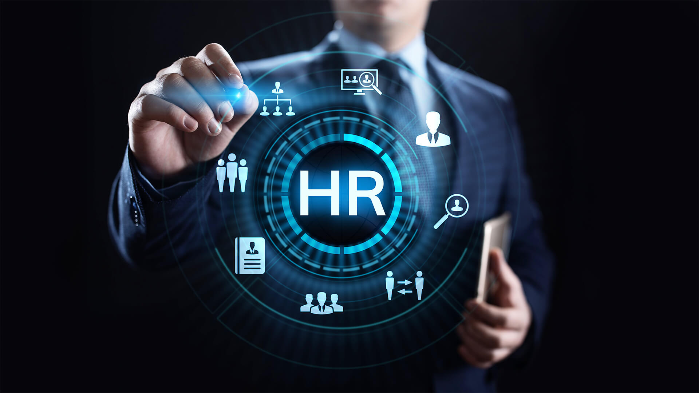

# HR Analysis Dashaboard
 #   

## Introduction

This dataset is gotten from kaggle. It is an interesting data I picked to work on as it is what an organization need to make an informed decision about the performaces on it staff.

The project is to analyze and derive insights to answer crucial questions and help the team management make data driven decions

**_Disclaimer_** : _All dataset and reports do not represent any company, institution or country, but just a dummy dataset gotten online to demonstate the capabilities of Power BI._

## Problem Statement 

How does the employee performance looks like
what is the percentage of employee due for promotion
whhat percentage of employee lives closely to the office
How long as most of our employee worked with us
what percentage of employee was active?

## Skills / Concept demonstrated

The following Power Bi features were incoporated: 
- DAX
- Quick Measure
- Modelling
- Filters
- Formatting
- Bookmark

## Visualization and Insight

The report comprises of a page

_page-0001.jpg)

Performance: Only 15% of employees demonstrate high performance, indicating the need for strategies to improve overall employee performance.

Job Satisfaction: Dissatisfaction levels are relatively high at 38%, suggesting the importance of addressing factors contributing to low satisfaction to enhance employee motivation and engagement.

Proximity to Office: A majority (69%) of employees live close to the office, potentially facilitating convenience and minimizing commuting challenges.

Promotion Consideration: Only 5% of employees are currently eligible for promotion, indicating a selective process based on exceptional performance or required skills.

## - Recommendations:

Emphasize performance improvement initiatives, address job dissatisfaction concerns, consider flexible work arrangements, and establish transparent promotion processes to enhance employee engagement and motivation.

You can interact with the report here: https://www.novypro.com/project/hr-attrition-analysis-

THANK YOU 😄

Chat me up on Linkedln: http://linkedin.com/in/salau-gideon-ond-aat-bsc-and-aca-in-view-330a4a1a0

Twitter: @LateefGideon

Whatsapp: 08100657265
